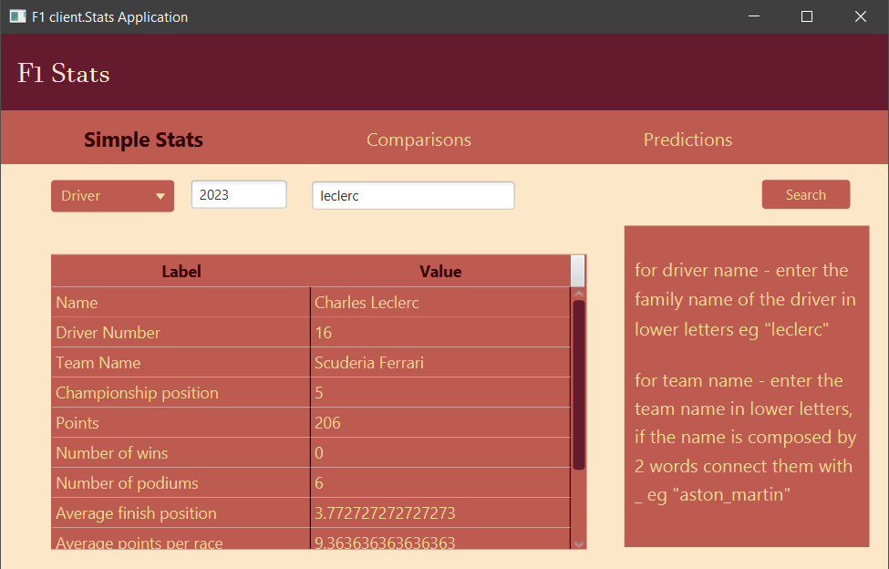

# F1_Stats

**F1_Stats** is a JavaFX desktop application that displays statistics and comparisons for Formula 1 drivers and teams. It allows users to search for performance data by season, compare two entities side-by-side, and (in future versions) predict future performance based on past results.

---

## 🚀 Features

- 📊 **Stats**: Enter a driver or team name along with a season to view their performance (wins, podiums, average finish, etc.).
- ⚖️ **Comparison**: Compare the performance of two drivers or teams from the same season.
- 🔮 **Predictions** *(Coming soon)*: Predict future performance based on historical data.

---

## 🛠 Technologies Used

- Java 23
- JavaFX 23 (with FXML)
- CSS (for styling)
- JSON (for data handling)

---

## 🔧 Setup Instructions

### ✅ Prerequisites

- Java JDK 17 or newer
- JavaFX SDK 23.0.1

### ⚙️ JavaFX Configuration (VM Options)

Make sure to include the following **VM options** in your run configuration. Replace PATH_TO_JAVAFX_LIB with the path to your local JavaFX SDK lib folder:

```bash
--module-path="PATH_TO_JAVAFX_LIB"
--add-modules=javafx.controls,javafx.fxml,javafx.web
```
---

## ▶️ Running the application
1. Clone or download the repository.
2. Open the project in your preferred Java IDE (e.g., IntelliJ IDEA or Eclipse).
3. Add the JavaFX library to the module path.
4. Run the Main class

---

## 🧩 Module Configuration
Ensure the following modules are added in your project structure:
- javafx.controls
- javafx.fxml
- javafx.web
- org.json (or another JSON library)

---

##  Screenshots

### ▶️ Main page


### 📊 Simple Stats page


### ⚖️ Comparisons page


---

## 🔮 Future Improvements
- Implement prediction logic using past performance trends.
- Add error messages
- Enhance UI with charts

---

## 👩‍💻 Author
Created by Bianca Helena Radoi.

This project is for educational or personal use and is not affiliated with Formula 1 or any related organization.